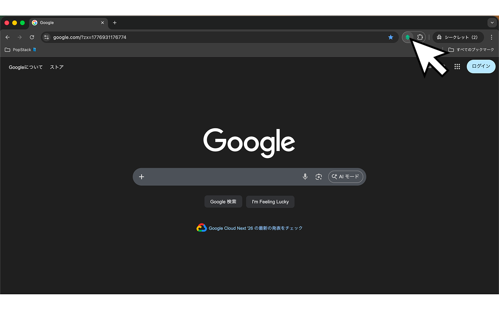
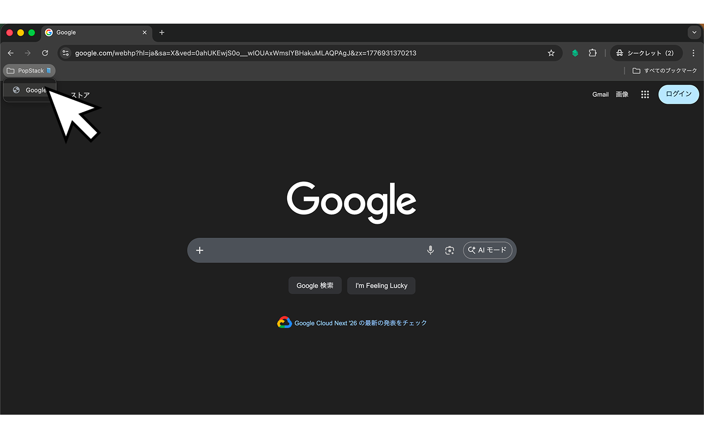
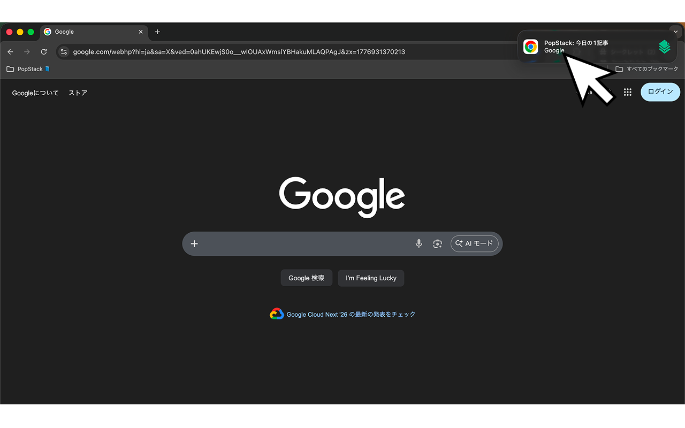
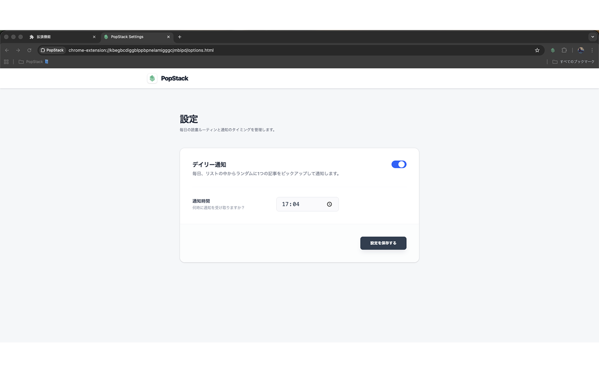

#  PopStack

## 概要
PopStackは、「あとで読む」として溜まりがちなWeb記事（積読）の消化をサポートするChrome拡張機能です。
気になる記事をワンクリックで専用のブックマークフォルダに保存し、毎日指定した時間にランダムで1記事を対象に通知を行います。

## 主要機能
1. **スタック（保存）とポップ（削除）**: 拡張機能アイコンをクリック、または**ページ上で右クリックメニュー**から、気になる記事を専用のブックマークに保存・解除します。URLの重複保存を自動でブロックする機能も備えています。
2. **積読のバッジ可視化と警告**: 拡張機能アイコンの右下に、現在溜まっている未読記事の件数をバッジとして表示します。一定件数（30件など）を超えるとバッジの色が警告色に変化し、溜めすぎを防ぎます。
3. **アドレスバー（Omnibox）検索**: アドレスバーに `pop` と入力してスペースまたはTabキーを押すと、保存した記事をタイトルやURLから高速検索し、直接アクセスできます。
4. **デイリーリマインダー**: 設定した時間に、保存された記事の中からランダムに1件を選び、デスクトップ通知で提示します。
5. **環境設定と多言語対応**: 通知の有効化・無効化、および通知時間の変更が行えます。また、ブラウザの言語設定に合わせて日本語・英語UIに自動で切り替わります。

## 強み・工夫点

### 1. 極限まで削ぎ落とした操作性
タグ付けやカテゴリ分類といった複雑な管理機能をあえて排除しました。ツールバーのアイコンを1回クリックするだけで保存（Stack）され、もう一度クリックすると解除（Pop）されるシンプルなトグル形式を採用し、ユーザーのブラウジングを妨げません。

### 2. ブラウザ標準機能の拡張によるデータポータビリティ
独自の外部データベースを構築せず、Chromeネイティブのブックマーク機能（`chrome.bookmarks` API）のデータ層を直接活用しています。これにより、アカウント登録や外部サーバーへの通信が不要となり、ユーザーのプライバシーを保護しつつ、ブラウザ標準の同期機能による複数端末間のデータ共有を自然な形で実現しています。

### 3. ランダム抽出とバッジ警告による「積読」の確実な消化
一般的な「あとで読む」ツールは、リストが膨大になるにつれてユーザーの認知負荷が上がり、結果として放置されがちです。PopStackでは、Chromeの `alarms` API を用いて毎日1記事だけをランダムに抽出して通知します。また、未読数が閾値を超えるとバッジ色で視覚的に警告することで、読むことを能動的に促します。

### 4. アドレスバー連動によるシームレスなアクセス
Chromeの `omnibox` APIを活用し、拡張機能のポップアップを開くことなく、いつもの検索バーから直接保存済み記事をサジェスト・検索できる動線を確保しました。

### 5. 堅牢なテストアーキテクチャ
Vitestを利用したテスト環境を構築し、バックグラウンドで動作する各モジュール（アラーム、通知、ブックマーク、Omnibox等）のChrome APIをモック化することで、ブラウザ依存のロジックに対して高いテストカバレッジを実現し、機能追加時の安全性を担保しています。

## スクリーンショット
<!-- docs/images フォルダに画像を配置した場合の例です。適宜変更してください -->

  ##### 保存
  

  ##### 保存場所
  

  ##### 通知
  

  ##### 設定画面
  

## 技術スタック
* **Frontend**: React 19, TypeScript, Tailwind CSS
* **Build**: Vite
* **Testing**: Vitest, JSDOM
* **Chrome Extension API (Manifest V3)**:
  * `chrome.bookmarks`: 記事の永続化
  * `chrome.alarms` / `chrome.storage`: バックグラウンドでの時間管理と設定保存
  * `chrome.notifications`: OSネイティブ通知の呼び出し
  * `chrome.omnibox`: アドレスバー連携
